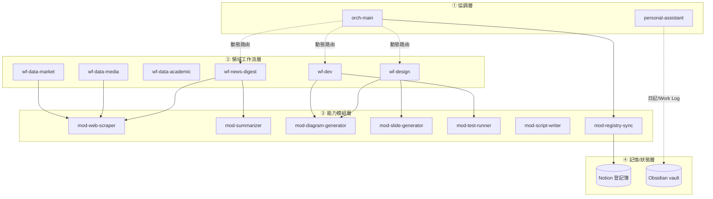

# AI-Agent-Subagent-Skill

公版 Claude Code Subagent 與 Skill 的架構化管理專案。目標是把日常工作（設計、開發、資料分析、測試、內容呈現等）拆解成一組分層清晰、職責單一、可重複使用的 Agent 與 Skill，避免每次遇到新需求都重新設計一次架構。

## 架構設計

整體遵循四層架構，關注點分離：**誰負責觸發（何時何處執行）** 與 **誰負責定義行為（做什麼、怎麼做）** 徹底解耦，Agent 定義本身不涉及任何排程/觸發邏輯。

```
① 協調層 Orchestrator     → 判斷請求該找誰、要串幾個工作流
② 領域工作流層 Workflow    → 各自完整生命週期（規劃→執行→驗證→交付）
③ 能力模組層 Capability    → 單一職責、無領域判斷、被上層呼叫
④ 記憶/狀態層 Memory       → 排程執行之間的狀態延續（外部化，不寫在 Agent 定義內）
```

### 分層判斷標準

| 層級 | 判斷依據 |
|---|---|
| ① 協調層 | 不執行任何領域工作，只做路由與多 Agent 協作規劃 |
| ② 領域工作流 | 核心難度來自需要**領域判斷力**，有自己完整的生命週期，通常僅本領域可重用 |
| ③ 能力模組 | 核心難度來自**步驟多、需要串接排序**，無領域判斷，換任何領域都適用，跨領域可重用 |
| ④ 記憶/狀態層 | Agent 定義只寫「規則」，實際儲存體（如狀態檔案、外部登記簿）在 Agent 之外 |

### 完整依賴關係圖



> `wf-data-academic` 未列出對③模組的依賴，因其查證需求偏向精確核對原文用詞，直接使用 WebSearch／WebFetch，未透過 `mod-web-scraper` 中介。
>
> `mod-registry-sync` 是唯一直接對接④記憶/狀態層的③模組，負責把①②層的執行狀態寫入 Notion 登記簿；`personal-assistant` 則直接搭配 `obsidian-note-conventions` 這份 Skill 寫入 Obsidian，兩者是不同的內容性質（狀態追蹤 vs 內容典藏），詳見下方「Notion 與 Obsidian 分工」。

## 命名規則

| 層級 | 前綴 | 範例 |
|---|---|---|
| ① 協調層 | `orch-` | `orch-main` |
| ② 領域工作流 | `wf-` | `wf-dev`、`wf-data-academic` |
| ③ 能力模組 | `mod-` | `mod-web-scraper` |
| Skill | 不加前綴，語意導向命名 | `mermaid-syntax` |

**Description 三段式公式**：`[做什麼功能]。[觸發情境/關鍵字]。[所屬層級與可重用範疇]。` 第一段影響自動路由準確度，第三段是給未來維護者看的定位註記。

## 目錄結構

```
AI-Agent-Subagent-Skill/
├── README.md
├── INDEX.md                          # 完整項目索引（狀態、依賴、參考來源）
└── .claude/
    ├── agents/
    │   ├── orch-main.md              # ① 正式協調層
    │   ├── wf-news-digest.md         # ② 每日新聞蒐集
    │   ├── wf-data-media.md          # ② 媒體可靠度判讀
    │   ├── wf-data-academic.md       # ② 學術引用審查
    │   ├── wf-data-market.md         # ② 市場財報分析
    │   ├── wf-design.md              # ② 設計提案協調
    │   ├── wf-dev.md                 # ② 軟體開發協調
    │   ├── mod-web-scraper.md        # ③ 網路資料蒐集
    │   ├── mod-summarizer.md         # ③ 去重與摘要
    │   ├── mod-diagram-generator.md  # ③ 流程圖生成
    │   ├── mod-slide-generator.md    # ③ 簡報生成
    │   ├── mod-test-runner.md        # ③ 測試執行
    │   ├── mod-script-writer.md      # ③ 講稿生成
    │   └── mod-registry-sync.md      # ③ Notion 登記簿讀寫
    └── skills/
        ├── mermaid-syntax/SKILL.md
        ├── web-scraping-patterns/SKILL.md
        ├── content-summarization/SKILL.md
        ├── source-reliability-assessment/SKILL.md
        ├── academic-citation-review/SKILL.md
        ├── financial-analysis-framework/SKILL.md
        ├── test-script-conventions/SKILL.md
        ├── speech-script-structure/SKILL.md
        └── obsidian-note-conventions/SKILL.md
```

> `personal-assistant`（①，隱含協調）目前建議放在 `~/.claude/agents/`（個人層級），未隨此公版 repo 一起發布，因其內容偏向個人化日常事務設定。

## 核心設計原則

1. **觸發層與定義層解耦**：Agent 定義內不寫排程邏輯（幾點跑、跑幾次），觸發方式在部署時才決定（`/loop`、Desktop 排程、Cloud Routine）
2. **能力模組無領域判斷**：③層 Agent 換任何呼叫方都要能直接使用，不能預設自己知道「誰在呼叫我」
3. **知識與身分分離**：可重用的判斷邏輯（語法規則、評估框架）拆成 Skill，Agent 本體只保留角色定位與流程協調，避免每次啟動都載入不必要的細節內容
4. **風險等級決定行為準則，而非權限鎖**：低風險任務用「先做後告知」，高風險/不可逆操作用「先確認再執行」，而非每個 Agent 都套用最嚴格的權限管制
5. **無人值守情境需要明確的預設值與誠實失敗機制**：排程觸發的 Agent（如 `wf-news-digest`）不能卡住等待確認，也不能為了看起來完整而虛構結果
6. **版權合規內建於資料蒐集與摘要源頭**：`mod-web-scraper`、`mod-summarizer` 的 Skill 都內含引用限制與改寫規範，避免侵權風險擴散到下游所有呼叫方

## Notion 與 Obsidian 分工

④記憶/狀態層目前分成兩種不同性質的儲存需求，分別對應不同工具：

| 用途 | 工具 | 讀寫方式 | 適用對象 |
|---|---|---|---|
| Agent 執行狀態追蹤（誰跑了、跑得如何、最後執行時間） | Notion | 透過 `mod-registry-sync` 模組（掛載 Notion MCP） | 任何①②層 Agent，不受觸發層是本機或雲端限制 |
| 實際產出內容的長期典藏（日記、Work Log） | Obsidian | `personal-assistant` 直接搭配 `obsidian-note-conventions` Skill 寫入 | 僅限本機觸發（`/loop`、Desktop 排程）的項目 |

**兩者不互相替代，也不建議混用**：Obsidian MCP 依賴本機執行中的 Local REST API 服務（`127.0.0.1`），Cloud Routine 觸發的工作流（如 `wf-news-digest`）連不到本機環境，因此狀態追蹤一律走 Notion；本機觸發的內容型記錄（日記等）才適合走 Obsidian。

## 已知限制與注意事項

- **Skill 探索目前僅支援扁平結構**：`.claude/skills/` 只掃描頂層，`<skill-name>/SKILL.md` 為固定格式，不支援巢狀資料夾分類；分類靠命名語意與 `INDEX.md`，不靠實體資料夾
- **多 Agent 協作依賴 `Agent` 工具**（原稱 `Task`，兩名稱目前皆可用）：協調型 Agent（如 `orch-main`、`wf-news-digest`）的 `tools` 欄位必須明確包含 `Agent`，否則無法實際委派子任務，這是硬性開關而非預設行為
- **`mod-slide-generator` 依賴外部 `pptx` Skill**：需確認實際部署環境已具備對應 Skill，否則此模組無法正常運作
- **開源 Skill 一律改寫，不直接複製**：避免破壞原作者的 `${CLAUDE_SKILL_DIR}` 內部路徑引用，也避免授權疑慮
- **Obsidian MCP 本質是本機服務**：需要本機安裝並啟用 Obsidian 的 Local REST API 社群外掛（伺服器跑在 `127.0.0.1`），Obsidian 應用程式須保持執行中才能連線；不適合搭配 Cloud Routine 等不依賴本機在線的觸發層

## 目前進度

| 層級 | 數量 | 狀態 |
|---|---|---|
| ① 協調層 | 2 | 已全數建立 |
| ② 領域工作流層 | 6 | 已全數建立 |
| ③ 能力模組層 | 7 | 已全數建立 |
| Skill | 9 | 已全數建立 |
| ④ 記憶/狀態層 | 2（Notion 登記簿、Obsidian vault） | 基礎設施待使用者端設定 |

①②③層與全部 Skill（22 個項目）皆已建立完成。完整的項目狀態、依賴關係與參考來源，見 [`INDEX.md`](./INDEX.md)。

## Roadmap

- [ ] 在 Notion 建立登記簿資料庫本體（欄位：名稱、層級、觸發型態、狀態、最後執行結果、依賴模組），供 `mod-registry-sync` 讀寫
- [ ] 在本機安裝並設定 Obsidian 的 Local REST API 外掛，供 `personal-assistant` 寫入日記／Work Log
- [ ] 依實際使用量評估是否需要拆分 `orch-main` 的路由邏輯（目前為單一 Agent，未來若規則複雜化可考慮進一步模組化）
- [ ] 視新需求持續擴充②③層，遵循既有的分類標準（端到端領域 vs 可重用階段模組）判斷歸屬
